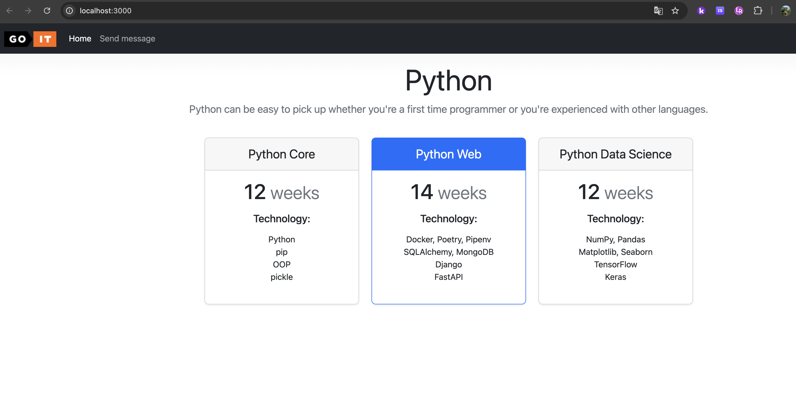
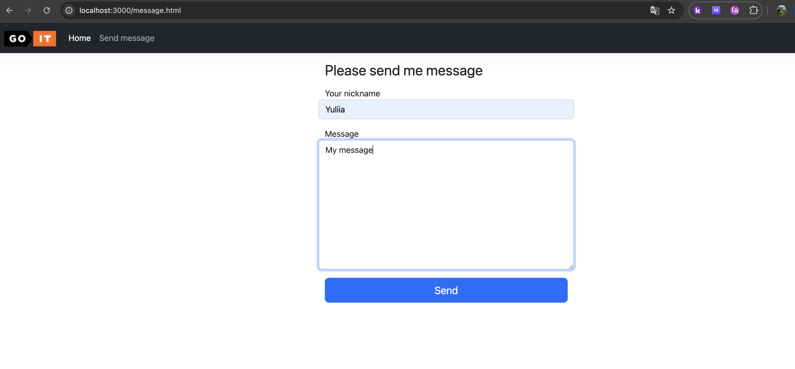
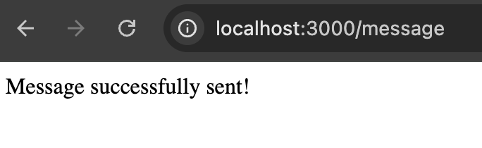
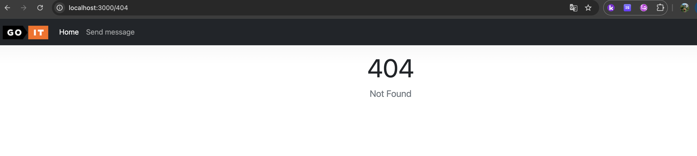
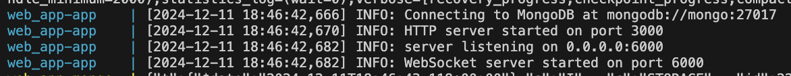
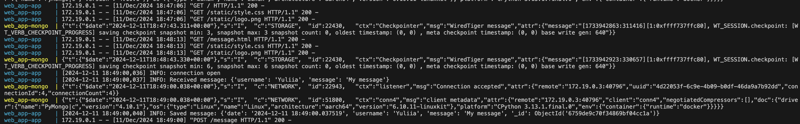
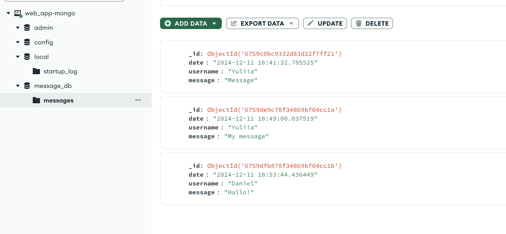
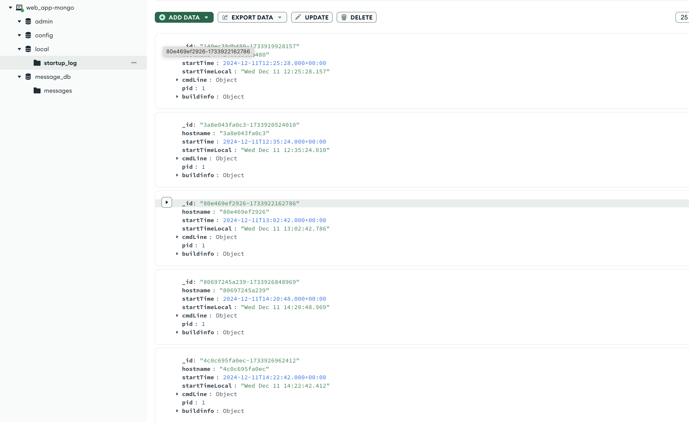

# Фінальне завдання

Привіт, друзі!

Вітаємо на фінальному етапі вашої захопливої подорожі крізь простори курсу
комп’ютерних систем 😉 Подивіться, як багато ви вже досягли! І зараз вам
потрібно **виконати домашнє завдання**, яке є **фінальним по курсу**.

Ця остання робота — це не просто завдання, це ваша перемога. Чи готові ви
показати своє розуміння та вміння? Ви вже робили це раніше і зараз можете
зробити це знову 💪🏼

Це завдання комплексне й охоплює знання з різних модулів курсу.

Ваша мета — створення вебзастосунку, який взаємодіє з сервером за допомогою
сокетів та здатний зберігати інформацію у базі даних MongoDB.

У цьому практичному завданні ви закріпите такі навички:

### Робота з HTTP-сервером:

- Створення вебдодатку на Python без використання вебфреймворків.
- Робота з маршрутизацією та обробкою статичних ресурсів.

### Робота із Сокетами:

- Реалізація простого Socket-сервера для обробки даних.
- Використання протоколу UDP або TCP для взаємодії між вебдодатком і сервером.

### Використання Docker:

- Створення Docker-контейнера для вебдодатку та Socket-сервера.
- Створення Dockerfile та написання docker-compose.yaml для автоматизації
  розгортання.

### Робота з MongoDB:

- Збереження даних у базі даних MongoDB.
- Створення записів у форматі, що має значення для реального застосування.

> [!NOTE]
>
> Нехай це завдання стане для вас не тільки викликом, але й можливістю взяти
> участь у реальному інженерному процесі, що підготує вас до подальших викликів
> у світі комп'ютерних систем. Бажаємо вам успіхів та захопливого досвіду
> вирішення завдань! 🎢

### Підготовка та завантаження домашнього завдання

1. Створіть публічний репозиторій `goit-cs-hw-06`.
2. Виконайте завдання та відправте його у свій репозиторій.
3. Завантажте робочі файли на свій комп’ютер та прикріпіть їх в LMS у форматі
   `zip`. Назва архіву повинна бути у форматі ДЗ6_ПІБ.
4. Прикріпіть посилання на репозиторій `goit-cs-hw-06` та відправте на
   перевірку.

### Формат оцінювання

- Оцінка від 0 до 100

> [!TIP]
>
> 👉🏻 Якщо є помилки або недоліки виконання, кількість балів за кожне завдання
> зменшується пропорційно до наявних помилок на розсуд ментора.

> [!IMPORTANT]
>
> 💡 Відправляйте ДЗ на перевірку, коли зроблено все можливе, оскільки кількість
> спроб здачі завдання впливає на отриманий бал! За кожну наступну спробу після
> другої (тобто з третьої) максимальна можлива кількість балів зменшується на 5.
> Критерії оцінювання робіт у магістратурі GoIt Neoversity

> [!WARNING]
>
> ☝🏻 УВАГА!! У вас є можливість обрати підхід до виконання та можливого
> доопрацювання домашнього завдання:
>
> 1. задовольнитися першою отриманою оцінкою (звісно ж, якщо вона вище
>    прохідного бала),
> 2. намагатися отримати вищий бал шляхом можливого послідуючого доопрацювання
>    роботи у відповідності з фідбеком ментора.
>
> Обраний підхід до виконання ДЗ необхідно зазначити у полі для здачі до
> прикріпленого завдання. За відсутності коментаря ментор дотримується першого
> підходу й виставляє отриману оцінку.

### Формат здачі

- Прикріплені файли репозиторію у форматі `zip` з назвою ДЗ6_ПІБ.
- Посилання на репозиторій.

## Технічний опис завдання

Вам необхідно реалізувати найпростіший вебдодаток, не використовуючи
вебфреймворк.

### Інструкція та вимоги до виконання

За аналогією до розглянутого в конспекті прикладу, створіть вебдодаток з
маршрутизацією для двох `html`-сторінок: `index.html` та `message.html`. За
основу візьміть наступні файли.

Також:

- обробіть під час роботи програми статичні ресурси: `style.css`, `logo.png`;
- організуйте роботу з формою на сторінці `message.html`;
- у разі виникнення помилки `404 Not Found` повертайте сторінку `error.html`.
- ваш HTTP-сервер повинен працювати на порту `3000`.

Для роботи з формою створіть Socket-сервер на порту `5000`. Алгоритм роботи має
бути такий:

- вводите дані у форму,
- вони потрапляють у вебдодаток, який пересилає його далі на обробку за
  допомогою `socket` (протокол `UDP` або `TCP` на ваш вибір) Socket-серверу,
- Socket-сервер переводить отриманий байт-рядок у словник і зберігає його в базу
  даних MongoDb.

Формат запису документа MongoDB має бути наступного вигляду:

```bash
{
 "date": "2022-10-29 20:20:58.020261",
 "username": "krabaton",
 "message": "First message"
},
{
"date": "2022-10-29 20:21:11.812177",
"username": "Krabat",
 "message": "Second message"
}
```

Ключ `"date"` кожного повідомлення — це час отримання повідомлення:
`datetime.now()`. Тобто кожне нове повідомлення від вебпрограми має дописуватися
до бази даних з часом отримання.

### Критерії прийняття

1. Використано для створення вебпрограми один файл `main.py`. Запущено
   HTTP-сервер і Socket-сервер у різних процесах.
2. Створено `Dockerfile` та запущено додаток як Docker-контейнер.
3. Написано `docker-compose.yaml` з конфігурацією для застосунку та MongoDB.
4. Використано Docker Compose для побудови середовища, команду
   `docker-compose up` для запуску середовища.
5. За допомогою механізму `voluemes` збережено дані з бази даних не всередині
   контейнера.
6. Оброблено статичні ресурси: `style.css`, `logo.png`.
7. У разі виникнення помилки `404 Not Found` повертається сторінка `error.html`.
8. Робота з формою організована згідно з наведеними вище вимогами.
9. Формат запису документа MongoDB відповідає вищезазначеним вимогам.

> [!CAUTION]
>
> Критерії прийняття домашнього завдання є обов’язковою умовою оцінювання
> домашнього завдання ментором. Якщо якийсь з критеріїв не виконано, ДЗ
> відправляється ментором на доопрацювання без оцінювання. Якщо вам “тільки
> уточнити”😉 або ви “застопорилися” на якомусь з етапів виконання— звертайтеся
> до ментора у Slack

### Результати виконаного завдання
















